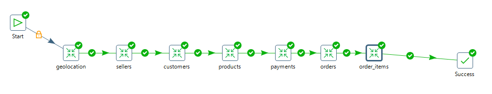
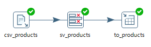

# Olist

## Objetivo
- O objetivo deste projeto é apresentar as etapas do processo completo de ETL (Extract Transform Load) ou Extração Transformação e Carga dos dados, com o foco em respoder perguntas de negócio.

## Etapas do projeto
- 1  [x] Problema do negócio
- 2  [x] Perguntas de negócio
- 3  [x] Coleta de dados
- 4  [x] Modelo de dados transacional
- 5  [x] Conhecendo os dados
- 6  [x] Modelagem do data warehouse
- 7  [x] Repesentação do processo de ETL
- 8  [x] Configurando docker-compose
- 9  [] Carga full dos arquivos.csv para o banco transacional (oltp)
- 10 [] Carga inical no data warehouse
- 11 [] Realizando limpeza e transformações iniciais
- 12 [] Carga incremental diaria dos dados
- 13 [] Realizando limpeza e transformações do dia
- 14 [] Apresentando os resultados
- 15 [] Tecnicas utilizadas

### Problema de negócio
- O gestor deseja saber algumas informações sobre como está a saúde de sua empresa.

### Perguntas de negócio
- [] Quantos produtos por pedido
- [] Quais os top 10 produtos mais vendem
- [] Quais os top 10 produtos menos vendem
- [] Quais são as top 10 vendedores que mais vendem
- [] Quais são as top 10 vendedores que menos vendem
- [] Quais são as top 10 clientes que mais compram
- [] Quais são as top 10 clientes que menos compram
- [] Quantos produtos foram cancelados
- [] Quantos produtos foram entregues
- [] Quais os tipos de pagamento existentes
- [] Quantos vendedores estão cadastrados por estado
- [] Quantos clientes estão cadastrados por estado
- [] Quais os tipos de pagamentos cadastrados
- [] Quais os tipos de pagamentos mais frequentes
- [] Quais os tipos de pagamentos menos frequentes
- [] Quais os top 10 pagamentos efetudos mais caros
- [] Quais os top 10 pagamentos efetudos mais baratos
- [] Quais os top 10 estados que realizam mais pedidos
- [] Quais os top 10 estados que realizam menos pedidos
- [] Qual o faturamento total das vendas
- [] Qual o faturamento de vendas por ano
- [] Qual o faturamento de vendas por mes
- [] Qual o faturamento de vendas por dia
- [] Qual o faturamento de vendas por produto
- [] Qual o faturamento de compras por cliente
- [] Qual o faturamento de vendas por vendedor
- [] Quais os top 10 fretes mais caros
- [] Quais os top 10 fretes mais baratos
- [] Qual o estado que mais compra
- [] Qual o estado que menos compra
- [] Qual o estado que mais vende
- [] Qual o estado que menos vende

### Coleta de dados
- Nesta etapa foi feito a extração dos dados diponibilizados no Kaggle.
- link: https://www.kaggle.com/datasets/olistbr/brazilian-ecommerce

### Modelo de dados transacional
- Imagem disponivel no link acima

### Conhecendo os dados
- Nesta etapa foi realizado uma analise dos dados, para enter como será desenvolvido o modelo dimensional que terá como foco responder as perguntas de negócio, sem que atrapalhe as operações diarias do sistema transacional.

### Modelagem do data warehouse
- Nesta etapa foi desenhado o modelo dimencional que irá atender as **perguntas de negócio**

### Repesentação do processo de ETL
- Nesta etapa podemos visualizar uma representação do processo de ETL completo que será realizado.

### Configurando docker-compose
- Nesta etapa foi adicionado um arquivo **docker-compose.yml** com as configurações dos bancos de dados que serão utilizados.
- O serviço de oltp será responsável por armazenar as tabelas do banco de dados transacional, que serão carregados dos arquivos .csv que foram obtidos já em etapas anterios.
- O serviço de dw será responsável por armazenar as tabelas do banco de daaos analitico, que serão carregados com a extração dos dados que estão no banco de dados transacional.

### Carga full dos arquivos.csv para o banco transacional (oltp)
- Nesta etapa será adicionado imagens do processo de ETL realizado utilizando a ferramenta Pentaho (data integration)

#### Explicação do processo
- Inicia com o job Start oltp full
  - Ele chama a primeira **Transform**
    - A Transform realiza o seu processo
- O **Job** recebe o resultado da **Transform**
  - O job chama a proxima **Transform**
    - E segue este processo até que o Job chame todas as Transforms

##### **Job Start oltp full**

##### **Transform geolocation**

##### **Transform sellers**

##### **Transform customers**

##### **Transform products**

##### **Transform payments**

##### **Transform orders**

##### **Transform order_items**

## Tecnicas utilizadas
- No item 5 Conhecendo os dados da **Etapas do projeto**
  - Foi utilzado a biblioteca **pandas** para fazer as analises dos dados.
- No item 6 Modelagem do data warehouse da **Etapas do projeto**
  - Foi utilizado o software SQL Power Archtect para o desenvolvimento da modelagem do data warehouse.
- No item 7 Repesentação do processo de ETL da **Etapas do projeto**
  - Foi utilizado o programa **LibreOffice Draw** e **Paint** para o desenvolvimento do desenho arquitetural do processo completo.  